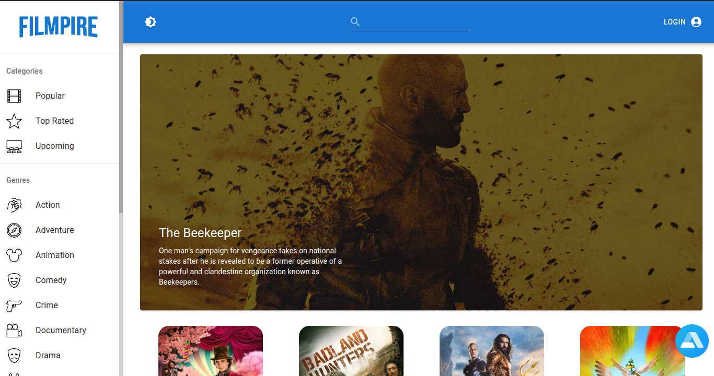

# Film Search

[](LICENSE)




## Description

Your go-to app for effortlessly discovering the latest movies. Easily search and find the perfect film based on your preferences. Whether it's action, drama, or comedy, Filmpire has you covered. Welcome to a user-friendly interface where your perfect film night is just a search away.

## Table of Contents

- [Project Name](#project-name)
  - [Description](#description)
  - [Table of Contents](#table-of-contents)
  - [Demo](#demo)
  - [Technologies Used](#technologies-used)
  - [Features](#features)
  - [Installation](#installation)
  - [Usage](#usage)
  - [Contributing](#contributing)
  - [License](#license)
  - [Acknowledgments](#acknowledgments)
  - [Contact](#contact)

## Demo

[Visit Website](https://filmsearchapp.vercel.app/)

## Technologies Used

HTML, TailwindCSS, Git & GitHub, React, Sanity, MaterialUI

## Features

Search for movies by many different paramiters and get detailed information on selected movies.

## Installation

Provide step-by-step instructions on how to install and run your project locally.

```bash
# Example installation steps
git clone git@github.com:austinmargarone/netflix_clone.git
cd your-repo
npm install
npm start
   ```


## Contributing

We welcome contributions from the community! To contribute to the project, follow these steps:

1. Fork this repository.
2. Create a new branch (`git checkout -b feature/your-feature-name`).
3. Make your changes and commit them (`git commit -am 'Add new feature'`).
4. Push to the branch (`git push origin feature/your-feature-name`).
5. Create a new Pull Request.

Please review our [Contributing Guidelines](CONTRIBUTING.md) for more details.

## License

This project is licensed under the [License Name]. See the [LICENSE](LICENSE) file for details.

## Contact

For questions or support, please contact Austin Margarone at austin@margarone.dev.
